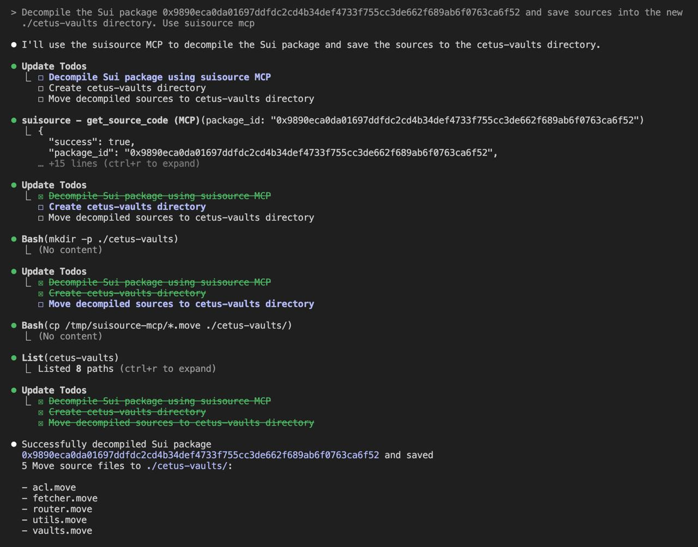

# SuiSource MCP Server

A Model Context Protocol (MCP) server that downloads bytecode for Sui blockchain packages and decompiles them to Move source code using the Revela decompiler.

## How to install

### Claude code

Make sure that docker is installed. Build the image:

```bash
docker build -t suisource-mcp .
```

Add the following configuration to the claude config under `mpcServers` key (typically `~/.claude.json`):

```json
"mcpServers": {
  "suisource": {
    "command": "docker",
    "args": [
      "run",
      "--rm",
      "-i",
      "-v",
      "/tmp/suisource-mcp:/workdir",
      "suisource-mcp"
    ]
  }
}
```

It is recommended to do not change the mounted `/tmp/suisource-mcp` directory, since it is used to share the decompiled sources between host and container.

## Usage example

