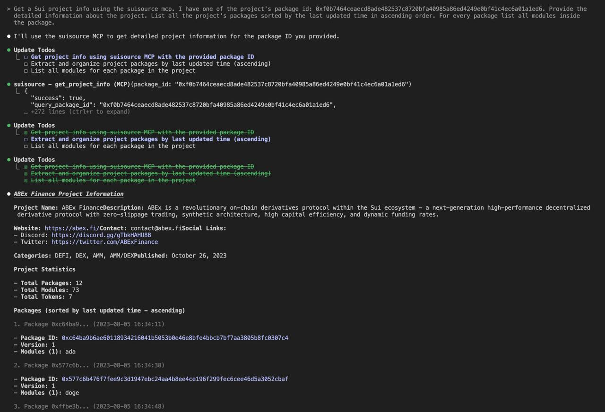
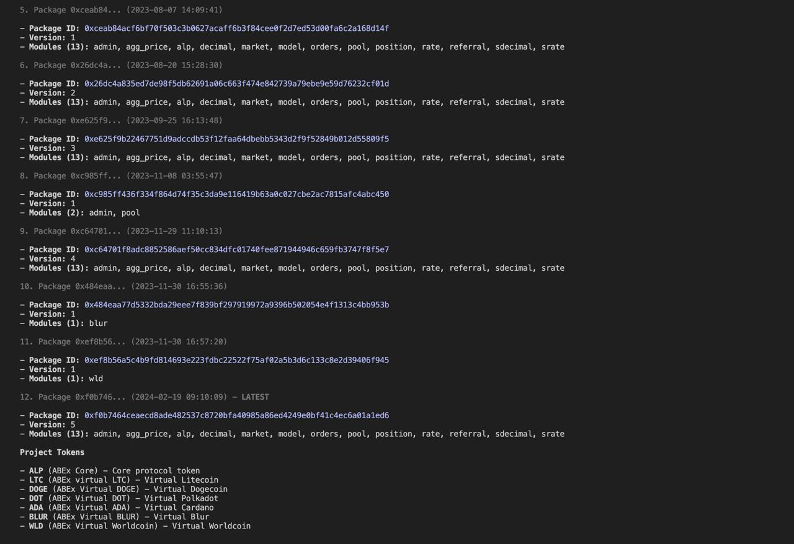

# SuiSource MCP Server

A Model Context Protocol (MCP) server that can be used to fetch information about Sui projects and its packages, as well as download a package bytecode and decompile it using the Revela decompiler. 

## Tools Available

- **health_check**: Check if the server and revela binary are working correctly
- **get_source_code**: Download bytecode for a Sui package ID and decompile it using revela. Sources are saved to the mounted workdir
- **get_project_info**: Get complete project information including all packages, modules, and version history. Takes one package ID and returns full project details with all related packages sorted by last change time. Requires time for projects with a big number of packages.

## How to install

### Claude code

Make sure that docker is installed. Build the image:

```bash
docker build -t suisource-mcp .
```

Add the following configuration to the claude config under the `mpcServers` key (typically `~/.claude.json`):

```json
"mcpServers": {
  "suisource": {
    "command": "docker",
    "args": [
      "run",
      "--rm",
      "-i",
      "-v",
      "/tmp/suisource-mcp:/workdir",
      "suisource-mcp"
    ]
  }
}
```

It is recommended to do not change the mounted `/tmp/suisource-mcp` directory, since it is used to share the decompiled sources between host and container.

**By default last updated time isn't fetched for packages.** If you also want to be able to fetch last updated times for project's packages, then you need to set a private Sui RPC url via additional `"-e", "SUI_RPC_URL=<url>` arguments to the MCP server. Note that some RPC providers do not fully support the `ChangedObject` filter that is needed to get all transaction blocks, where the package was changed. In my case the BlastAPI endpoint worked well. You can check the filter support by the following request:

```bash
curl '<Sui RPC url>' \
  -H 'content-type: application/json' \
  --data '{
    "jsonrpc":"2.0",
    "id":2,
    "method":"suix_queryTransactionBlocks",
    "params":
    [
      {
        "filter":
        {
          "ChangedObject":"0x75b2e9ecad34944b8d0c874e568c90db0cf9437f0d7392abfd4cb902972f3e40"
        },
        "options":
        {
          "showEffects":true,
          "showBalanceChanges":true,
          "showInput":true
        }
      },
      null,
      200,
      true
    ]
}
```

If the request returns 1 or more transactions, then the `ChangedObject` filter is supported by the provider. Otherwise, empty data will be returned.

## Usage example

`get_source_code`:


`get_project_info`:



